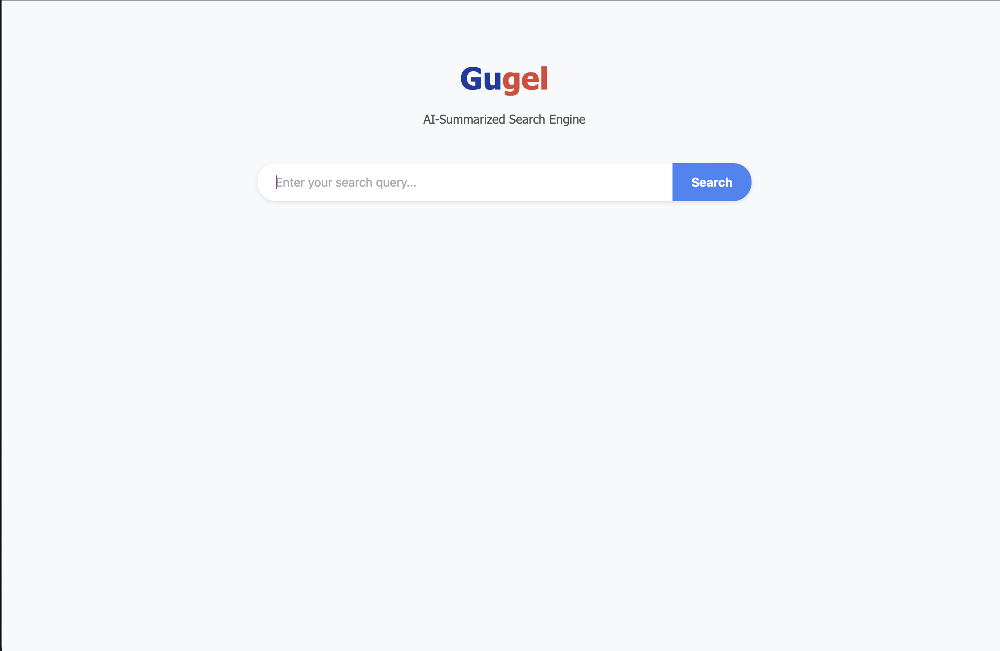
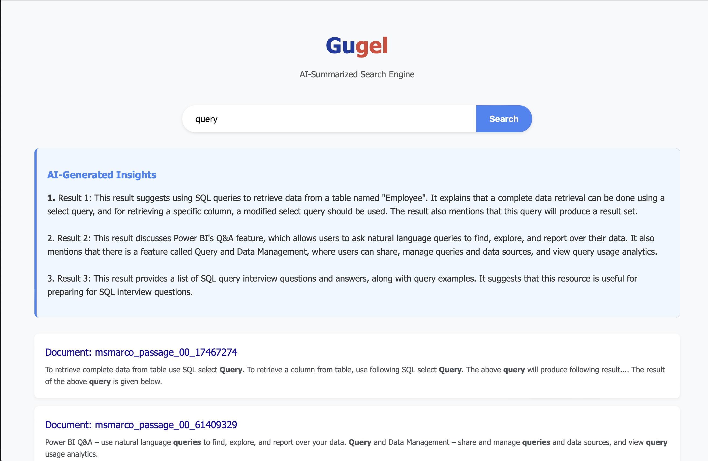

# Gugel - AI result summarizer

A semantic search engine with LLM integration using Elasticsearch and Hugging Face.

### Prerequisites

- Docker and Docker Compose
- Hugging Face API token (get one at https://huggingface.co/settings/tokens)

### Quick Start

1. Clone this repository:
   ```
   git clone <repository-url>
   cd <repository-directory>
   ```

2. Create a `.env` file with your credentials:
   ```
   # Create .env file
   touch .env
   
   # Add your Hugging Face API token
   echo "HF_API_TOKEN=your_huggingface_token_here" >> .env
   echo "HF_MODEL=mistralai/Mistral-7B-Instruct-v0.3" >> .env
   ```

3. Build and run the application:
   COMING SOON! (Rencana make docker)

4. Access the application at http://localhost:8001

### Indexing Data

in the shell
```
python search_engine/index.py
```

DOWNLOADS MSMARCO-PASSAGES-v2 to local!! indexes on elasticsearch!! (DOWNLOAD IS ~20 GB, careful)

## SCREENSHOTS





## Architecture

- **Django Backend**: Serves the web interface and API endpoints
- **Elasticsearch**: Provides the search engine capabilities
- **Hugging Face LLM**: Enhances search results with AI-generated insights

## Problems rn

- Summary not so good, maybe prompt engineer 
- Some queries not working, maybe index issue (more data?, only 0.03% of data is indexed)

License:

- Favicon from [favicon.cc](https://www.favicon.cc/?action=icon&file_id=1009219), licensed under Creative Commons
- LLM Model (Mistral-7B-Instruct-v0.3) from Hugging face serverless API